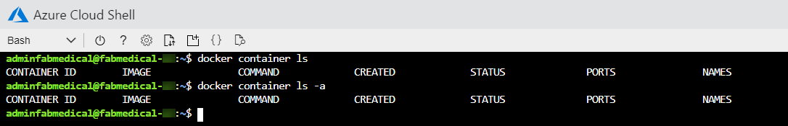
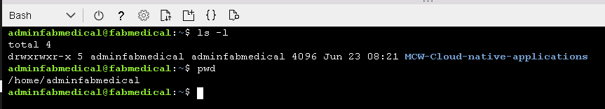
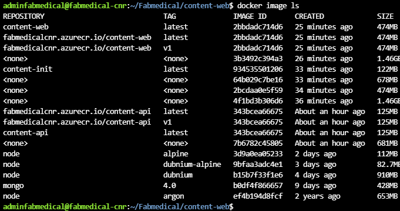
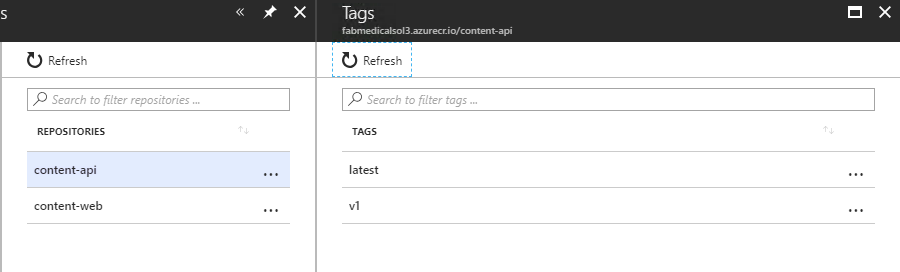

**Contents**

<!-- TOC -->

- [Cloud-native applications before the hands-on lab setup guide](#cloud-native-applications-before-the-hands-on-lab-setup-guide)
  - [Overview](#overview)
  - [Requirements](#requirements)
  - [Before the hands-on lab](#before-the-hands-on-lab)
    - [Task 1: Setup Azure Cloud Shell](#task-1-setup-azure-cloud-shell)
    - [Task 2: Connect securely to the build agent](#task-2-connect-securely-to-the-build-agent)
    - [Task 3: Complete build agent VM checking](#task-3-complete-build-agent-vm-checking)
    - [Task 4: Download Starter Files](#task-4-download-starter-files)
    - [Task 5: Run MongoDB container in Azure Linux VM (mongoDB)](#task-5-run-mongodb-container-in-azure-linux-vm)
    - [Task 6: Build the Docker Images](#task-6-build-the-docker-images)
    - [Task 7: Push Images to Azure Container Registry](#task-7-push-images-to-azure-container-registry)
 

<!-- /TOC -->

# Cloud-native applications before the hands-on lab setup guide

## Overview

Before the hands-on lab, you will need to prepare the environment by deploying the database and the application locally on a virtual machine using Docker and MongoDB. 

## Requirements

1. Microsoft Azure subscription must be pay-as-you-go or MSDN.

   - Trial subscriptions will _not_ work.

   - To complete this lab setup, ensure your account includes the following:

     - Has the [Owner](https://docs.microsoft.com/azure/role-based-access-control/built-in-roles#owner) built-in role for the subscription you use.

     - Is a [Member](https://docs.microsoft.com/azure/active-directory/fundamentals/users-default-permissions#member-and-guest-users) user in the Azure AD tenant you use. (Guest users will not have the necessary permissions.)

   - You must have enough cores available in your subscription to create the build agent and Azure Kubernetes Service cluster in [Task 5: Deploy ARM Template](#Task-5-Deploy-ARM-Template). You'll need eight cores if following the exact instructions in the lab, more if you choose additional agents or larger VM sizes. Execute the steps required before the lab to see if you need to request more cores in your sub.

2. Local machine or a virtual machine configured with:

   - A browser, preferably Chrome for consistency with the lab implementation tests.


## Before the hands-on lab

**Duration**: around 60 minutes

You should follow all of the steps provided in this section _before_ taking part in the hands-on lab ahead of time as some of these steps take time.

### Task 1: Setup Azure Cloud Shell

1. Open a cloud shell by selecting the cloud shell icon in the menu bar.

   
   
   As this is the first time to access the cloudshell, you will need to create a Azure storage account.
   
   CLick "**Show advanced settings**".

          
   
   Remain the default parameter in
      - **Subscription**
      - **Cloud Shell region**
      - **Resource group**
   
   Create storage account by entering:
   - for **Storage account**, refer to the **Environment Details**, find and copy the value from **deploymentid**
   - Suggest to simply combinate "storage" and  **deploymentid** as the storage account name
   - enter value "**blob**" in the **File share**

   Refer to below screencap as example 

   


2. The cloud shell opens in the browser window. Choose **Bash** if prompted or use the left-hand dropdown on the shell menu bar to choose **Bash** from the dropdown (as shown). If prompted, select **Confirm**.

   

3. You should make sure to set your default subscription correctly. To view your current subscription type:

   ```bash
   az account show
   ```

   


### Task 2: Connect securely to the build agent

In this section, you validate that you can connect to the new **"Build Agent VM"** (Linux server) vis SSH in the cloudshell.

1. Open Azure Cloud Shell console and run the SSH command to connect the Linux server:

   > **Note**: If you don't have a cloud shell available, refer back to [Task 1: Setup Azure Cloud Shell](#task-1-setup-azure-cloud-shell).

   Refer to the **"Environment Details"**, copy the value from **"Command to Connect to Build Agent VM"**
   - Copy and paste the command in cloud shell
  
   
   ```
2. When asked to confirm if you want to connect, as the authenticity of the connection cannot be validated, type `yes`.

3. When asked for the password, - copy the **"Build Agent VM Password"** and paste in the cloudshell for password login

4. SSH connects to the VM and displays a command prompt such as the following. Keep this cloud shell window open for the next step:

   `adminfabmedical@fabmedical-SUFFIX:~$`

   

### Task 3: Complete build agent VM checking

In this task, you check the install docker packages 

1. Go to the cloud shell window that has the SSH connection open to the build agent VM.

2. check and verrify the installed `docker version` command, and note the output now shows the server version as well.

    

3. Run a few Docker commands, verify the docker package has been installed and able to use

    - One to see if there are any containers presently running.

      ```bash
      docker container ls
      ```

    - One to see if any containers exist, whether running or not.

      ```bash
      docker container ls -a
      ```

4. In both cases, you have an empty list but no errors while running the command. 
Your build agent is ready with the Docker engine running correctly.

    

### Task 4: Download Starter Files

In this task, you use `git` to copy the lab content to the **"Build Agent VM"** so that the lab starter files will be available to use.

> **Note**: If you don't have a cloud shell available, refer back to [Task 1: Setup Azure Cloud Shell](#task-1-setup-azure-cloud-shell).

> **Note**: If you are not able to connect to the Linux server, refer back to [Task 2: Connect securely to the build agent](#task-2-connect-securely-to-the-build-agent).


1. Type the following command and press `<ENTER>`:

   ```bash
   git clone https://github.com/microsoft/MCW-Cloud-native-applications.git
   ```
 

2. The lab files download.

   

3. We do not need the `.git` folder, and later steps will be less complex if we remove it. Run this command:

   ```bash
   rm -rf MCW-Cloud-native-applications/.git
   ```

4. Starter files should cloned in the Linux console and you can find the folder structure as below
      
   
   Have a look on the location of starter files by copy below command 

   ```bash
   cd /home/adminfabmedical/MCW-Cloud-native-applications/Hands-on\ lab/lab-files/developer/
   ```
   
      

### Task 5: Run MongoDB container in Azure Linux VM (mongoDB)

In this task, you will take the starter files and run the node.js application as a Docker application.  You will build the Docker images from the existing files and run containers to test and execute the application.

1. From Azure Cloud Shell, connect to your build agent(Linux VM) if you are not already connected.

2. Type the following command to create a Docker network named `fabmedical`:

   ```bash
   docker network create fabmedical
   ```

3. Run an instance of mongodb to use for local testing.

   ```bash
   docker container run --name mongo --net fabmedical -p 27017:27017 -d mongo:4.0
   ```

   > **Note**:  With the existing source code written for MongoDB, it can be pointed towards the Azure Cosmos DB MongoDB API endpoint. The Azure Cosmos DB Emulator could be used for local development on Windows; however, the Cosmos DB emulator does not support Linux. As a result, when using Linux for development, MongoDB is still needed for local development environments; with Azure Cosmos DB used for data storage in the cloud. This allows existing source code written for MongoDB storage to be easily migrated to using Azure Cosmos DB backend.

4. Confirm that the mongo container is running and ready.

   ```bash
   docker container list
   docker container logs mongo
   ```

   

5. Connect to the mongo instance using the mongo shell and test some basic commands:

   ```bash
   mongo
   ```

   ```text
   show dbs
   quit()
   ```
   > **Note**: If you are not able to enter the key "( )" in the cloud shell, you can try to copy "**quit()**" from this guide and paste in the cloudshell. Or you can try to use the windows's **on-screen keyboard** to enter the config.


   

6. To initialize the local database with test content, first navigate to the content-init directory and run npm install.

   Location of the starter files

   
   
   ```bash
   cd ~/clouddrive/MCW-Cloud-native-applications/Hands-on\ lab/lab-files/developer/content-init
   ```
   ```bash
   npm install
   ```
   > **Note**: In some cases, the `root` user will be assigned ownership of your user's `.config` folder. If this happens, run the following command to return ownership to `adminfabmedical` and then try `npm install` again:

   ```bash
   sudo chown -R $USER:$(id -gn $USER) /home/adminfabmedical/.config
   ```

7. Initialize the database.

   ```bash
   nodejs server.js
   ```

   

8. Confirm that the database now contains test data.

   ```bash
   mongo
   ```

   ```text
   show dbs
   use contentdb
   show collections
   db.speakers.find()
   db.sessions.find()
   quit()
   ```
     > **Note**: If you are not able to enter the key "( )" in the cloud shell, you can try to copy "**quit()**" from this guide and paste in the cloudshell. Or you can try to use the windows's **on-screen keyboard** to enter the config.

   This should produce output similar to the following:

   

### Task 6: Build the Docker Images

In this task, you will build the Docker images for the application --- one for the API application and another for the web application. Each image will be created via Docker commands that rely on a Dockerfile.

1. From cloud shell connected to the build agent VM, type the following command to view any Docker images on the VM. The list will only contain the mongodb image downloaded earlier.

   ```bash
   docker image ls
   ```

2. From the content-api (`cd /content-api`) folder containing the API application files and a Dockerfile, type the following command to create a Docker image for the API application. This command does the following:

   - Executes the Docker build command to produce the image

   - Tags the resulting image with the name `content-api` (-t)

   - The final dot (`.`) indicates to use the Dockerfile in this current directory context. By default, this file is expected to have the name `Dockerfile` (case sensitive).

   ```bash
   docker image build -t content-api .
   ```

3. Once the image is successfully built, run the Docker images listing command again. You will see several new images: the node images and your container image.

   ```bash
   docker image ls
   ```

   Notice the untagged image. This is the build stage which contains all the intermediate files not needed in your final image.

   

4. Navigate to the content-web folder again and list the files. Note that this folder also has a Dockerfile.

   ```bash
   cd ../content-web
   ll
   ```

5. View the Dockerfile contents. Type the following command:

   ```bash
   cat Dockerfile
   ```

   > Notice that the `content-web` Dockerfile build stage includes additional tools for a front-end Angular application in addition to installing npm packages.

6. Type the following command to create a Docker image for the web application.

   ```bash
   docker image build -t content-web .
   ```

7. When complete, you will see **content-web** and **content-app** images now exist when you run the Docker images command.

   ```bash
   docker image ls
   ```

   


### Task 7: Push Images to Azure Container Registry

To run containers in a remote environment, you will typically push images to a Docker registry, where you can store and distribute images. Each service will have a repository that can be pushed to and pulled from with Docker commands. Azure Container Registry (ACR) is a managed private Docker registry service based on Docker Registry v2.

In this task, you will push images to your ACR account, version images with tagging, and setup continuous integration (CI) to build future versions of your containers and push them to ACR automatically.

1. In the [Azure Portal](https://portal.azure.com/), navigate to the **container registries** 
   

2. Select **Access keys** under **Settings** on the left-hand menu.

   

3. The Access keys blade displays the Login server, username, and password that will be required for the next step. Keep this handy as you perform actions on the build VM.

   > **Note**: If the username and password do not appear, select Enable on the Admin user option.

4. From the cloud shell session connected to your build VM, login to your ACR account by typing the following command. Follow the instructions to complete the login.

   ```bash
   docker login [LOGINSERVER] -u [USERNAME] -p [PASSWORD]
   ```

   For example:

   ```bash
   docker login fabmedicalsoll.azurecr.io -u fabmedicalsoll -p +W/j=l+Fcze=n07SchxvGSlvsLRh/7ga
   ```

   

   > **Tip**: Make sure to specify the fully qualified registry login server (all lowercase).

5. Run the following commands to properly tag your images to match your ACR account name.

   ```bash
   docker image tag content-web [LOGINSERVER]/content-web
   docker image tag content-api [LOGINSERVER]/content-api
   ```

   > **Note**: Be sure to replace the `[LOGINSERVER]` of your ACR instance.

6. List your docker images and look at the repository and tag. Note that the repository is prefixed with your ACR login server name, such as the sample shown in the screenshot below.

   ```bash
   docker image ls
   ```

   

7. Push the images to your ACR account with the following command:

   ```bash
   docker image push [LOGINSERVER]/content-web
   docker image push [LOGINSERVER]/content-api
   ```

   ![In this screenshot of the console window, an example of images being pushed to an ACR account results from typing and running the following at the command prompt: docker push [LOGINSERVER]/content-web.](media/image67.png "Push image to ACR")

8. In the Azure Portal, navigate to your ACR account, and select **Repositories** under **Services** on the left-hand menu. You will now see two containers **(2)**, one for each image.

   

9. Select `content-api` **(1)**. You will see the latest tag **(2)** is assigned.

   

10. From the cloud shell session attached to the VM, assign the `v1` tag to each image with the following commands. Then list the Docker images to note that there are now two entries for each image: showing the `latest` tag and the `v1` tag. Also note that the image ID is the same for the two entries, as there is only one copy of the image.

    ```bash
    docker image tag [LOGINSERVER]/content-web:latest [LOGINSERVER]/content-web:v1
    docker image tag [LOGINSERVER]/content-api:latest [LOGINSERVER]/content-api:v1
    docker image ls
    ```

    

11. Push the images to your ACR account with the following command:

    ```bash
    docker image push [LOGINSERVER]/content-web:v1
    docker image push [LOGINSERVER]/content-api:v1
    ```

12. Refresh one of the repositories to see the two versions of the image now appear.

    


You should follow all steps provided _before_ performing the Hands-on lab.